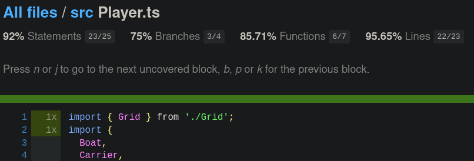
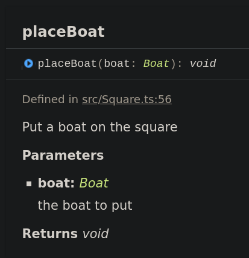

<p align="center">
  
</p>

     

  

<br>

# Battleship game

This repository is an implementation of the [Battleship game](<https://en.wikipedia.org/wiki/Battleship_(game)>) in TypeScript.

It was meant to learn some useful programming workflow concepts such as [Test Driven Development](https://en.wikipedia.org/wiki/Test-driven_development) (TDD), [unit testing](https://en.wikipedia.org/wiki/Unit_testing), [code coverage](https://en.wikipedia.org/wiki/Code_coverage), [documentation generation](https://en.wikipedia.org/wiki/Software_documentation), [CI/CD](https://en.wikipedia.org/wiki/Continuous_integration), git hooks...

## Getting started

This project can be bootstraped with NPM or Yarn in order to install the dependencies listed in the [`package.json`](package.json) file:

```shell
$ git clone https://github.com/johhnry/battleship-game
$ cd battleship-game
$ yarn # or npm install
```

## Git workflow

### Git hooks

A very nice feature of Git is that you can add hooks to various events and actions you do (push, commit, branch...).

An easy way to add hooks is to use [Husky](https://typicode.github.io/husky/#/) which for example adds a `pre-commit` hook to run the tests each time.

### Conventional Commits

[Conventional Commits](https://www.conventionalcommits.org/en/v1.0.0/) is a commit message specification which makes them human and machine readable and unify the development process.

Here is an example of a valid commit message:

```
docs: :memo: add readme and license
```

To validate that commit message with a git hook, we use [commitlint](https://github.com/conventional-changelog/commitlint).

To add meaningful emojis to the messages, we use [gitmoji](https://gitmoji.dev/) with the VSCode [extension](https://marketplace.visualstudio.com/items?itemName=vivaxy.vscode-conventional-commits) to make it easier 😍

## Unit tests

This project was developed with Test Driven Development in mind which means that the tests are written before or at the same time with the code itself.

The test framework is [Mocha](https://mochajs.org/) in combination with [Chai](https://www.chaijs.com/) which enables us to write human readable tests according to the [BDD](https://en.wikipedia.org/wiki/Behavior-driven_development) (Behavior-driven development) practice. For example:

```javascript
expect(() => grid.hitAt(location)).to.throw(SquareAlreadyMissError);
```

To run the tests, do:

```shell
$ yarn run test
```

### Code coverage

Code coverage is the process of measuring how much code is being tested.

To do this, we use [Istanbul](https://istanbul.js.org/) with its [nyc](https://github.com/istanbuljs/nyc) command line tool that we plug with the test framework, in this case Mocha.

By tracking which parts of the code is being imported in the tests, it can generate multiple output targets including a textual report in the command line:

```
------------------|---------|----------|---------|---------|-------------------
File              | % Stmts | % Branch | % Funcs | % Lines | Uncovered Line #s
------------------|---------|----------|---------|---------|-------------------
All files         |   86.73 |     86.3 |   81.63 |   86.73 |
 src              |   85.71 |     86.3 |   80.43 |   85.79 |
  Boat.ts         |     100 |      100 |     100 |     100 |
  Game.ts         |       0 |        0 |       0 |       0 | 1-97
  Grid.ts         |     100 |      100 |     100 |     100 |
  GridLocation.ts |     100 |      100 |     100 |     100 |
  Player.ts       |      92 |       75 |   85.71 |   95.65 | 90
  Square.ts       |     100 |      100 |     100 |     100 |
  errors.ts       |     100 |      100 |     100 |     100 |
 src/utils        |     100 |      100 |     100 |     100 |
  array.ts        |     100 |      100 |     100 |     100 |
  index.ts        |     100 |      100 |     100 |     100 |
------------------|---------|----------|---------|---------|-------------------
```

It also generates a HTML report with source code highlights (in the `coverage` directory):

<p align="center">
  
</p>

## Documentation

To generate the documentation from the code, we use [TypeDoc](https://typedoc.org/). It's really easy to use and the [TSDoc](https://tsdoc.org/) standard is quite familiar with other docs generators.

For example:

```typescript
/**
  * Put a boat on the square
  * @param boat the boat to put
  */
placeBoat(boat: Boat): void {
  this.status = SquareStatus.Boat;
  this.content = boat.id;
}
```

To generate the documentation, use `yarn run docs:generate`. It will output it in a `docs` directory.

<p align="center">
  
</p>

## Linting and formatting

The linting is handled by [ESLint](https://eslint.org/) and its VSCode integration.

This is the same for [Prettier](https://prettier.io/) that formats code.

To run them:

```
$ yarn run lint && yarn run format
```

## Note

The TypeScript logo and design were gracefully taken from their [branding](https://www.typescriptlang.org/branding/) page.

## Contributing

Pull requests are welcome. For major changes, please open an issue first to discuss what you would like to change.

Please make sure to update tests as appropriate.

## License


